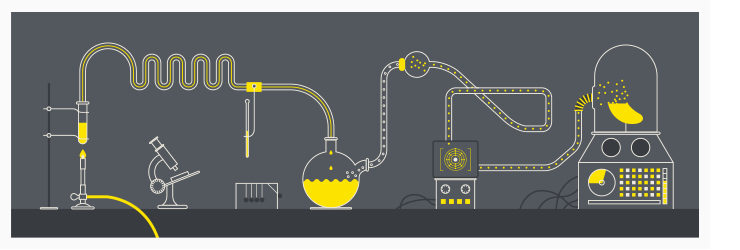

# Welcome to my Lab!

-----------------------------------------------------------------------------------------------------------------------------------

*Here you can find a collection of Jupyter Notebooks full of Python code and nice visualizations of my projects mainly in Econometrics and Machine Learning.*
## Thesis Project

Chapter | Description
--------|------------
[Chapter 1](https://nbviewer.jupyter.org/github/nikosga/Lab/blob/master/Thesis/Part%201__Data%20Cleaning.ipynb) | Cleaning and reshaping the datasets so that they can be used for analysis
[Chapter 2](https://nbviewer.jupyter.org/github/nikosga/Lab/blob/master/Thesis/Part%202__Regression%20Techniques.ipynb) | Constructing a model that predicts happiness while testing some algorithms on the way
[Chapter 3](https://nbviewer.jupyter.org/github/nikosga/Lab/blob/master/Thesis/Part%203__Predicting%20The%20Past.ipynb) | Predicting how happy were people back in the day.
